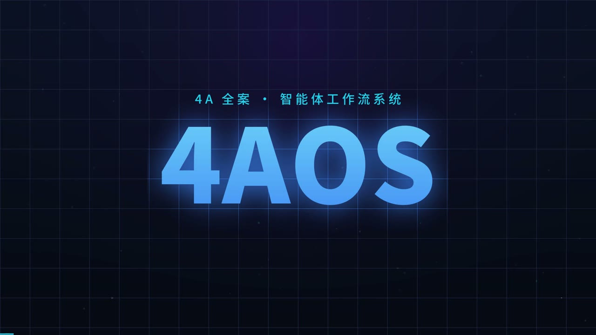

# 4AOS

> **From Brief to Business Impact** — 4A 全案智能体工作流。24 个专职 Agent 协作覆盖广告/营销/传播全业务周期。
>
> **先把话说准**：它交付的是 *Impact Plan*（可执行方案），不是 Impact 本身——效果依赖人工执行与数据回流。

[](./CHANGELOG.md) [](#适合谁--不适合谁)

```
"做个新茶饮 Campaign，预算 50 万，目标 Z 世代"
  → 澄清与确认 → 策略（多方案对抗选优）→ 创意与内容
    → 媒介与执行 → 合规审查 → 完整方案（8 章 + ROI + 合规说明）
```

---

## 🎬 演示视频

[](4aos_promo_video.mp4)

▶ **[点击播放完整演示（44 秒，含音频）](4aos_promo_video.mp4)**

> 说明：GitHub 仅对 `user-attachments` 附件 URL 渲染页内播放器，仓库文件无法内嵌自动播放。
> 上图为海报帧，点击即用 GitHub 自带播放器观看。

---

## 质量证据状态（先读这段）

我们对价值与证据分开表述，不用"流程完备"冒充"质量已验证"：

- ✅ **结构价值**（流程完备 / 合规拦截 / 决策留痕）：已通过全部结构化检查
- 🟡 **效率价值**（提案前端提效）：设计目标，以你的试点实测为准
- ❓ **质量溢价**（比强基线好多少）：**尚待盲测验证**——采用前请先跑一周试点

> 完整证据账本由 Qomob.AI 内部留存并持续更新，商务评估时可按需提供摘要。测什么、怎么算赢，协议在试点启动时与你预注册——别信我们，让数据作保。

---

## 适合谁 / 不适合谁

| 你是谁 | 结论 | 原因 |
|--------|------|------|
| **无代理的中长尾品牌**（预算 5-50 万） | ✅ **最强场景** | 备选项不是"更好的代理"而是"没有"。策略分解 + 媒介组合 + 合规扫描是你唯一可得的全案能力 |
| **代理商的比稿/提案前端** | ✅ 真实价值 | 压缩结构化初稿的 senior 工时；Junior 杠杆 + 方法论强制（需先解决商业授权与数据合规，见文末） |
| **高频营销事故品类**（医美/食品/金融） | ✅ 合规第一道网 | 广告法/平台规则扫描拦截低级事故。**但它是 LLM 读参考文件，不是法规数据库：`pass` ≠ 法律意见**，敏感品类必须过真人法务 |
| **大型企业**（有代理体系 + CDP/真 MMM） | ⚠️ 价值薄 | 无 first-party 数据接入，产出的方案不如内部两周做得贴身。可用作反审乙方方案的"同一把尺子" |
| **期待创意质量跃升** | ❌ 别抱此预期 | 创意天花板 = 模型天花板。系统选出的是既定策略框架内的最优解，产出**结构化的合格**，不是**独特的卓越** |
| **期待增长系统** | ❌ 不成立 | 媒介/ROI 数字是行业基准估算（内部讨论可用，客户面前须重做）；买到的方案生产工具，不是增长引擎 |

**给代理商的一个额外提醒**：多家代理用同一套模型库与模板会导致方案趋同，比稿胜负手（对客户业务的独特洞察）恰是本工具不承载的。用它做骨架、注入你的真洞察，甲方无感；直接交原始输出，采购闻得出模板味。

---

## 当前状态（v4.4.8 / 2026-09-03）

| 维度 | 数量 | 说明 |
|------|:----:|------|
| 专职 Agent | 24 | 覆盖策略 / 创意 / 内容 / 媒介 / 执行 / 合规 / 数据全链路 |
| 行业模板 | 13 | 9 传统 + 4 新兴（电竞/宠物/银发/ESG） |

> **对外文档边界**：本文件与 QUICKSTART / CHANGELOG / AGENCY_ONBOARDING 属对外资料包，只描述使用行为与采用流程；架构与实现细节由 Qomob.AI 内部留存。
>
> **过程文件归档（v4.4.7 起）**：全案过程产物按项目自动归档——草稿可回溯、可断点续跑；终稿经你确认后才生成为正式交付件。

---

## 怎么用

### 零配置启动（推荐）

直接说需求，系统自动路由：

```
"帮我们做个智能宠物喂食器 Campaign，预算 100 万，抖音+小红书"
```

→ 自动识别为 `campaign` 路径 × `deep` 模式（budget ≥ 30 万）。

### 四种模式

| 模式 | 深度 | 适用 |
|------|------|------|
| **deep** | 全流程（约 12 步） | 正式 Campaign / 大额预算 / 品牌升级 |
| **fast** | 精简流程 | 快速预览 / < 5 万预算 |
| **creative** | 创意优先 | 创意比稿 / 视觉方案 |
| **strategy** | 策略优先 | 品牌战略 / 定位规划 |

### 首次交互预期

完整 Campaign = 多步骤自动推进的对话。**默认半自动**：只在关键节点暂停（策略定音 / 预算定音 / 风险信号 / 假设超限 / 终稿交付），deep 全程约 3-5 次确认；其余步骤以进度行播报。说「每步都停」恢复逐步确认，说「接下来全自动」一路跑到终稿。可随时断点续跑或跳过。

> 详细入门见 [QUICKSTART.md](./QUICKSTART.md)（2 分钟）。

---

## 如何验证它的价值（别信我们，自己测）

两套验证方法都已就绪，成本低于任何一篇评估文章：

1. **代理商——三臂盲测**：拿 2 个真实比稿 Brief，对比 ①4Aos ②资深策略 + 通用 AI 单次生成 ③传统人工流程，让未参与者盲评。质量胜率达标才算赢，判定规则在试点启动时预注册。
2. **企业方——回放回测**：拿一个**已结束** Campaign 的 Brief + 真实结果，让系统重做方案，对比与实际效果的偏差。
3. **证据怎么升级**：跑完盲测并回流真实效果数据，本文件的质量证据状态才会逐级更新——在此之前，任何"质量更好"的说法都只是假设。

> 试点流程、判定阈值与配套工具由 Qomob.AI 在试点启动时提供并协助执行。

---

## 谁在干活

系统由 24 个专职 Agent 协作完成——从需求澄清、策略推导、创意发想，到媒介投放、执行统筹、合规审查与效果测算。你不需要了解内部分工：说清需求、在关键节点确认即可，每个环节的产出都会播报进度与结论。

---

## 版本进化

| 版本 | 用户可感知的变化 |
|------|----------------|
| **v4.4.8**（当前）| 对外资料包标准化；外发文档泄露面自动检查 |
| **v4.4.7** | 过程文件按项目归档；断点续跑；终稿确认后交付 |
| **v4.4.6** | 一周试点 + 回测方法；品牌档案免重复追问 |
| **v4.4.5** | 关键节点确认制（deep 约 3-5 次）；效果测量约定 |

> 完整更新日志见 [CHANGELOG.md](./CHANGELOG.md)。

---

## 相关文档

| 文档 | 用途 |
|------|------|
| [QUICKSTART.md](./QUICKSTART.md) | 2 分钟上手 |
| [CHANGELOG.md](./CHANGELOG.md) | 版本发布说明 |
| [AGENCY_ONBOARDING.md](./AGENCY_ONBOARDING.md) | Agency 落地手册（人机协作 SOP 与定价参考） |

---

## 版权与授权

**作者**：Qomob.AI & XSkill.dev

**版权声明**：本作品版权归 **Qomob.AI & XSkill.dev** 所有。

### 第三方素材声明

- **Python 依赖**：`PyYAML`（MIT License，Copyright (c) Kirill Simonov），按 MIT 许可条款使用，仅作为运行时依赖调用，未复制其源码入仓。其余脚本仅使用 Python 标准库（argparse / json / re / pathlib / typing 等）。
- **视觉素材**：本 skill 为营销策略工作流引擎，不渲染视觉产物，未引用任何第三方 UI 组件库或调色板（如 Tailwind CSS / Bootstrap / Ant Design 等）。

### 授权条款

- ✅ **个人学习与评估**：可免费使用、阅读、研究本 skill
- ✅ **内部非商业项目**：在署名 Qomob.AI & XSkill.dev 的前提下可使用
- ❌ **商业用途**：必须事先获得 Qomob.AI & XSkill.dev 书面授权
  - 包括但不限于：商业产品集成、付费 SaaS 服务、对外交付的项目、培训课程收费、Agency 商业比稿
- ❌ **再分发**：不得去除或修改版权声明与作者信息

如需商业授权，请联系 **Qomob.AI & XSkill.dev**。

> 未经授权而将本 skill 用于商业用途的，视为侵权行为，Qomob.AI & XSkill.dev 保留追究法律责任的权利。

> ⚠️ **历史许可变更说明**：本 skill 此前以 Apache License 2.0 发布，自 v4.4.4 起转为商业授权模式。已删除原 LICENSE 文件。在许可变更前已合法获取 Apache 2.0 副本的使用者，其在该许可下的权利不因本次变更而溯及性失效，但后续版本更新不再以 Apache 2.0 发布。

---

## 💬 加入群聊

<div align="center">
  
  <p>扫码加入微信群，与 XClaw 社区交流</p>
</div>
